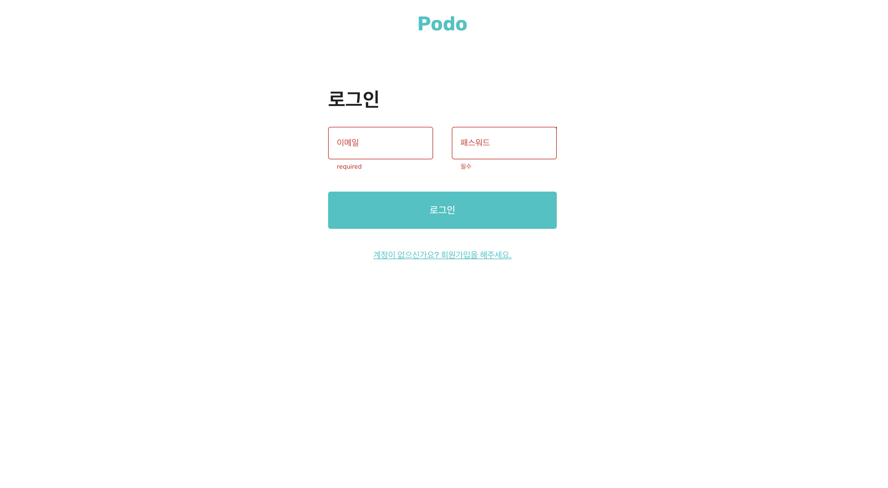

# 포도 (가족 커뮤니티 서비스)

실제 기술을 활용하여 가치를 만들어내기 위해선 전반적인 서비르의 흐름을 알아야한다고 생각했습니다. 그러다보니 백엔드 node.js의 기본적인 동작 원리가 궁금해져 소셜 미디어 프로젝트를 진행하였습니다. 


## 익히고자 하는 것. 

1. node.js 기반 express 프레임워크를 사용하여 백앤드 서버 로직을 직접 구현해보고 **restful API**에 대한 깊은 이해를 하는 것.
2. AWS EC2 인스턴스를 활용하여 가상 컴퓨터에 서버 소스 코드를 무중단 베포 해보는 것.
3. 프론트엔드 서버에서 클라이언트 상태 관리는 redux toolkit 서버 상태는 react-query를 사용하여 기술에 대한 이해 및 성능 개선을 하는 것. 
4. js를 ts로 바꾸어 타입 스크립트 컴파일러에 대한 깊은 이해를 하는 것.

서버는 **AWS EC2** 인스턴스를 활용하여 베포하였고 클라이언트 서버는 github에서 제공해주는 무료 호스팅 서비스인 gitHub Page를 활용하였습니다.

---

## 📅 프로젝트 기간

- **개발** : 2.22 - 현재 진행중 
- **리팩토링 및 기능 추가** : 정식 베포 이후, 피드백을 통해 기능 추가 예정
- **베포**
  - 백앤드 베포 AWS EC2, AWS 53, cloudFlare
  - 프론트엔드 베포 gitHub Page, gitHub Action

## 🏁 프로젝트 실행 방법

1. 의존성 패키지를 설치합니다.

```zsh
$ npm install
```

2. 로컬 개발 환경을 실행합니다.

```zsh
$ npm start
```

## 베포 링크 👇

[베포 페이지 보러가기](https://codyman0.github.io/podo)

로그인 

- id: visitor@naver.com 
- password: 12345 

## 개발 환경

- **node** (v18.15.0)
- **react.js** (v18.2.0)
- **react-router-dom**(v6.8.1)
- **react-hot-toast**(v2.4.0)
- **redux-toolkit**(v8.0.5)
- **redux-persist**(v6.0.0)
- **@mui/material**(v5.11.0)
- **formik** (v2.2.9)
- **yup** (v1.0.0)
- **typescript**(v4.9.3)

## 🔧 기술 스택

| 사용 기술   | 기술 채택 근거 |
| ----------- | -------------- |
| react.js    |                |
| redux-toolkit |                |
|    formik         |                | 
|    yup         |                |

## 페이지 UI

- 로그인 페이지



- 회원가입 페이지


- 홈 페이지


- 프로필 페이지


### git commit --prefix

```
[feat] 기능 추가, 삭제, 변경 - 코드 수정 발생 시
[fix] 버그 수정 - 코드 수정 발생 시
[design] CSS등 사용자 UI 디자인 변경 - 코드 수정 발생 시
[docs] 문서 추가, 삭제, 변경 - 코드 수정 없음
[style] 코드 형식, 정렬, 주석등의 변경, ex) 세미콜론 추가 - 코드 수정 발생 시 (동작에 영향 없음)
[refactor] 코드 리팩토링 ex) renaming a variable - 코드 수정 발생 시
[chore] 패키지 매니저 설정, yarn 모듈 설치 등 - 코드 수정 없음
[etc] 위에 해당하지 않는 모든 변경 ex) 빌드 스크립트 수정, 패키지 배포 설정 변경 - 코드 수정 없음
[rename] 파일 혹은 폴더명을 수정하거나 옮기는 작업만인 경우 - 코드 수정 없음
[remove] 파일을 삭제하는 작업만 수행한 경우 - 코드 수정 없음
[setting] 폴더/설정 추가,삭제 - 코드 수정 없음
```
